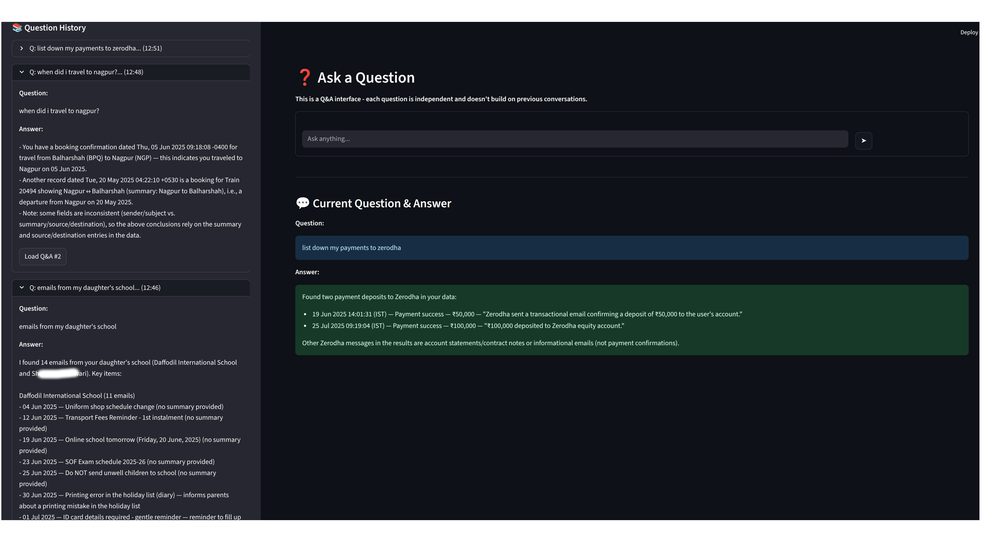
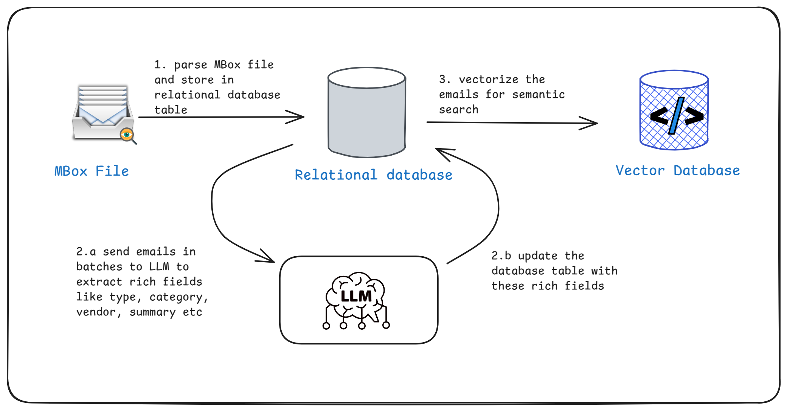
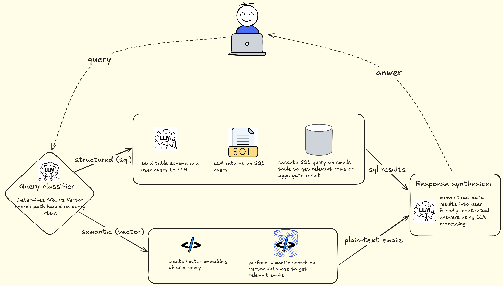

# Mail-Lens: AI-Powered Email Analysis Assistant

An intelligent chatbot system that analyzes and answers questions about your email data using advanced AI techniques including natural language processing, vector embeddings, and structured data querying.

## Use Case

Mail-Lens is designed to help users extract meaningful insights from their email data through natural language queries. Whether you're looking for specific transactions, travel expenses, or contextual information buried in email conversations, the system can:

- **Answer complex questions** about your email history using natural language
- **Find relevant emails** based on semantic similarity and context
- **Extract structured data** like purchases, travel bookings, and financial transactions
- **Provide summaries** of email content and patterns
- **Search across email metadata** including senders, subjects, dates, and categories



The tool is particularly useful for:
- Travel and booking history
- Vendor and transaction search
- Email content discovery and summarization

## ETL Phase

The system follows a comprehensive ETL (Extract, Transform, Load) pipeline:



### 1. **Extract** - Email Ingestion
- **Input**: Mbox files (Gmail export format)
- **Processing**: Batch processing with configurable batch sizes for memory efficiency
- **Parsing**: Extracts email metadata (sender, subject, date) and content (body)
- **HTML Handling**: Converts HTML emails to plain text using BeautifulSoup
- **Script**: `scripts/ingest_emails.py`

### 2. **Transform** - Data Processing & Annotation
- **Email Classification**: Categorizes emails by type (transactional, promotional, informational, educational, other)
- **Content Analysis**: Extracts structured data like amounts, vendors, items, and categories
- **Metadata Enhancement**: Adds source/destination information and generates summaries
- **Script**: `scripts/annotate_emails.py`

### 3. **Load** - Vector Embeddings & Storage
- **Structured Storage**: Maintains original data in SQLite for direct queries
- **Vector Embeddings**: Creates semantic embeddings using HuggingFace models
- **Chunking**: Splits email content into manageable chunks with overlap
- **Vector Database**: Stores embeddings in Qdrant vector database for similarity search
- **Script**: `scripts/build_vector_index.py`

## Agent Architecture

The system uses a sophisticated workflow-based agent architecture built with LlamaIndex:



### **Query Classification**
The agent first classifies user queries into two categories:
- **SQL Queries**: For structured data retrieval (filtering, aggregations, exact matches)
- **Vector Queries**: For semantic search and contextual understanding

### **Dual Processing Paths**

#### **SQL Path** (Structured Queries)
- Uses OpenAI's GPT model to convert natural language to SQL
- Queries the SQLite database directly for fast, structured data retrieval
- Handles filtering, aggregations, and exact field matches

#### **Vector Path** (Semantic Search)
- Uses HuggingFace embeddings for semantic similarity
- Searches the Qdrant vector database for contextually relevant emails
- Returns ranked results based on semantic similarity scores

### **Response Generation**
- Gets results from the selected path
- Uses OpenAI to generate natural language responses
- Provides structured summaries with relevant metadata

### **Workflow Components**
- **EmailQueryWorkflow**: Main workflow orchestrator using LlamaIndex's Workflow framework
- **Query Classification**: Determines processing path (SQL vs Vector)
- **Data Retrieval**: Executes SQL or vector search based on classification
- **Response Synthesis**: Generates final user-friendly responses

## Main Technologies Used

### **Core Framework**
- **LlamaIndex**: Workflow orchestration, agent management, and vector database integration
- **FastAPI**: High-performance web API framework
- **Streamlit**: Interactive web interface for Q&A

### **AI/ML Stack**
- **OpenAI GPT**: Natural language processing and SQL generation
- **HuggingFace Transformers**: Local embedding models (sentence-transformers/all-MiniLM-L6-v2)
- **LlamaIndex**: Workflow orchestration, vector database integration, and document processing
- **Groq**: Alternative LLM provider for email annotation

### **Data Storage**
- **SQLite**: Structured email data storage
- **Qdrant**: Vector database for semantic search
- **Pandas**: Data manipulation and analysis

### **Email Processing**
- **mail-parser**: Email parsing and metadata extraction
- **BeautifulSoup**: HTML email content processing
- **mailbox**: Mbox file handling

### **Development & Deployment**
- **Poetry**: Dependency management
- **Ruff**: Code formatting and linting
- **Python 3.11+**: Modern Python features and performance

### **Infrastructure**
- **SQLAlchemy**: Database ORM and connection management
- **Pydantic**: Data validation and serialization
- **Dotenv**: Environment variable management

## Getting Started

### Prerequisites
- Python 3.11+
- Poetry package manager
- OpenAI API key
- Mbox file with your emails

### Installation
```bash
# Clone the repository
git clone <repository-url>
cd mail-lens

# Install dependencies
poetry install

# Set up environment variables
cp .env.example .env
# Add your OpenAI API key to .env
```

### Usage

1. **Ingest Emails**:
   ```bash
   python scripts/ingest_emails.py --mbox path/to/your/emails.mbox
   ```

2. **Build Vector Index**:
   ```bash
   python scripts/build_vector_index.py
   ```

3. **Start the API**:
   ```bash
   python main.py
   ```

4. **Launch the UI**:
   ```bash
   streamlit run ui/new_chatbot.py
   ```

### Example Queries
- "Show me all Amazon purchases from last month"
- "Find emails about project deadlines"
- "Summarize my email conversations with John"